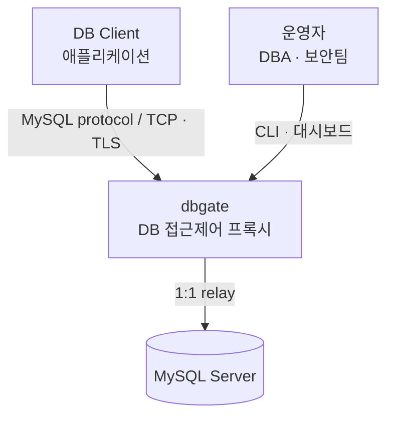
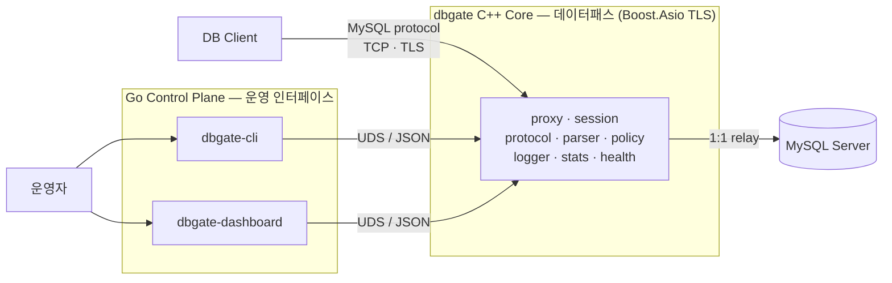
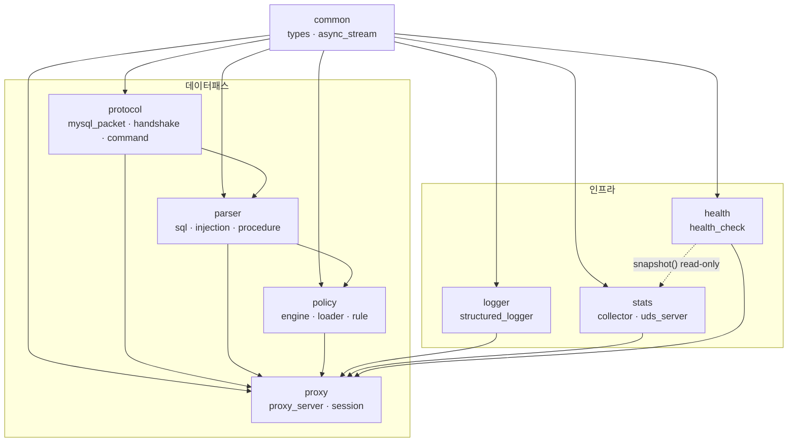
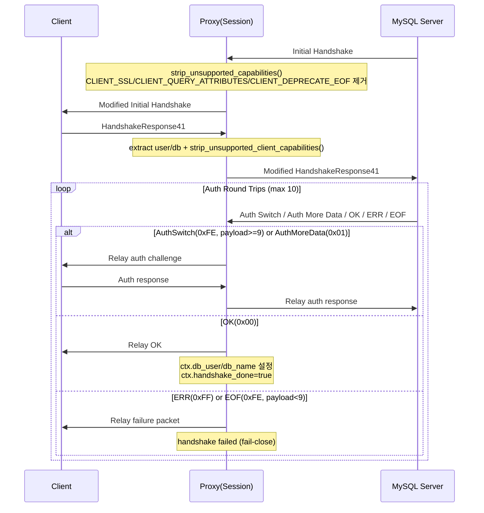
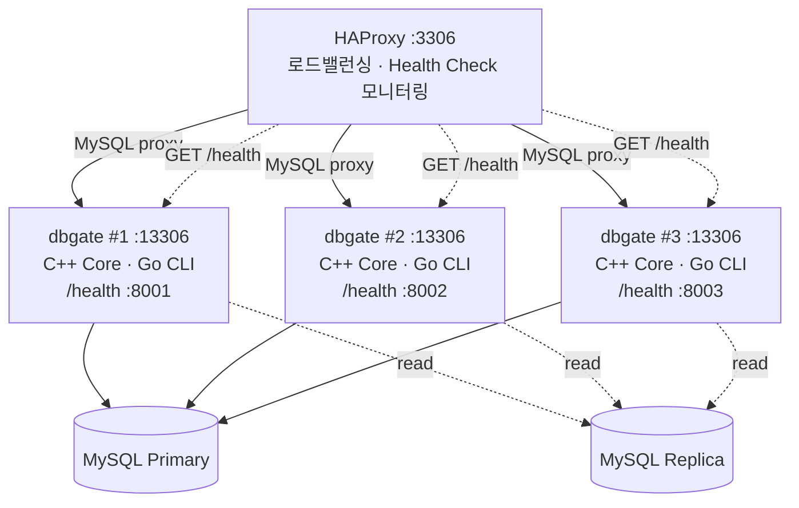

# dbgate 아키텍처 설명서

## 개요

dbgate는 MySQL 클라이언트와 MySQL 서버 사이에 위치하는 **DB 접근제어 프록시**입니다. 높은 성능이 요구되는 **데이터패스(data path)**는 C++로, 운영 편의성이 중요한 **컨트롤플레인(control plane)**은 Go로 구현되어 있습니다.

## 아키텍처 다이어그램

C4 모델 스타일로 3단계 깊이로 표현합니다. 각 레벨은 한 가지 관심사만 담당합니다.

### Level 1 — Context (외부 시스템 관계)



### Level 2 — Container (런타임 구성)



### Level 3 — Component (C++ Core 내부 모듈)



- 실선: 컴파일 타임 의존 (현재 구현)
- 점선: 읽기 전용 참조 (쓰기 없음)
- 무순환(DAG) 구조, `proxy`가 통합점
- `logger` / `stats` / `health`는 상위 계층으로 역의존하지 않음
- Go Control Plane의 sessions · policy_reload 기능은 현재 501 (planned)

## 데이터 흐름 상세

### 1단계: TCP 연결 수립

```
[DB Client] → TCP SYN → ProxyServer → Accept
                           │
                      Session 생성
                       (strand 할당)
```

### 2단계: MySQL 핸드셰이크



**HandshakeRelay의 역할:**
- 클라이언트 ↔ 서버 간 패킷을 투명하게 릴레이
- auth plugin 메커니즘 개입 없음 (호환성 최대화)
- 핸드셰이크 완료 후 SessionContext 채우기:
  - `db_user`: HandshakeResponse에서 추출
  - `db_name`: 초기 접속 DB 이름
  - `handshake_done`: true로 마킹

### 3단계: COM_QUERY 처리 루프

```
While (세션 활성):
    1. MysqlPacket 수신 (크기 헤더 + 페이로드)
       │
    2. extract_command(packet)
       │
       ├─ COM_QUERY 아니면
       │   ├─ COM_STMT_PREPARE/EXECUTE/RESET → 차단(Error 1235)
       │   └─ 그 외 커맨드 → 투명 릴레이 후 응답
       │
       ▼ COM_QUERY인 경우

    3. SQL Parser
       - sql_parser.parse(query_string)
       - ParsedQuery 반환 (command, tables, raw_sql)

    4. Injection Detection (병렬 가능)
       - InjectionDetector::check(raw_sql)
       - 현재는 보조 탐지(PolicyEngine 입력으로 직접 전달되지는 않음)

    5. Procedure Detection (병렬 가능)
       - ProcedureDetector::detect(parsed_query)
       - 현재는 보조 탐지(PolicyEngine 입력으로 직접 전달되지는 않음)

    6. Policy Engine 평가
       - PolicyEngine::evaluate(parsed_query, session_context)
       - 순서: 구문 차단 → 패턴 차단 → 사용자/IP → blocked_operations →
               시간대 → 테이블 → allowed_operations → 프로시저/스키마 → allow/default deny
       - PolicyResult (action=ALLOW/BLOCK, kLog는 현재 미사용)

    7-1. ALLOW인 경우
         └─ MySQL 서버로 릴레이
            └─ 응답을 클라이언트로 릴레이

    7-2. BLOCK인 경우
         └─ Error Packet 생성 (MySQL 호환)
         └─ 클라이언트에 오류 응답

    8. 로깅 (모든 경로)
       - ALLOW: StructuredLogger::log_query(entry)
       - BLOCK: StructuredLogger::log_block(entry)
       - JSON 포맷으로 기록

    9. 통계 갱신 (모든 경로)
       - StatsCollector::on_query(blocked)
       - Atomic으로 카운터 증가
```

## Fail-Close 원칙 (절대 위반 금지)

**Fail-Close의 의미:**
> 불확실한 상황에서 항상 차단(BLOCK)을 선택하는 보안 원칙.

### Fail-Close가 필수인 경우

#### 1. 파서 오류 발생

```cpp
auto parsed = sql_parser.parse(query);
if (!parsed) {
    // 파싱 실패 → 정책 엔진에 명시적으로 알림
    auto result = policy_engine.evaluate_error(parsed.error(), ctx);
    // 반드시 PolicyAction::kBlock을 반환 (fail-close)
}
```

**이유:**
- 공격자가 파서가 이해하지 못하는 복잡한 SQL을 작성했을 수 있음
- 파서 우회 공격 방지 (예: DROP/**/TABLE)

#### 2. 정책 엔진 내부 오류

```cpp
PolicyResult evaluate() {
    // 설정 로드 실패? → BLOCK
    if (!config) return PolicyResult{.action = PolicyAction::kBlock};

    // 규칙 평가 중 오류? → BLOCK
    if (unexpected_error) return PolicyResult{.action = PolicyAction::kBlock};
}
```

#### 3. 정책 일치 없음

```cpp
// 기본값은 kBlock (default deny)
PolicyResult result{.action = PolicyAction::kBlock};

// 명시적 allow 규칙이 있을 때만 kAllow
if (matches_allow_rule(query, ctx)) {
    result.action = PolicyAction::kAllow;
}

return result;  // 일치 없으면 kBlock
```

#### 4. 정책 로드 실패

```cpp
auto loaded = PolicyLoader::load(config_path);
if (!loaded) {
    // 기존 정책 유지하거나 서비스 차단
    // fail-open은 절대 금지
    logger.error("Policy load failed: {}", loaded.error());
    // ProxyServer는 모든 쿼리를 차단하거나 기존 정책으로 계속
}
```

### 절대 금지하는 패턴

```cpp
// ❌ WRONG: 파서 오류 → ALLOW
if (!parsed) {
    return PolicyResult{.action = PolicyAction::kAllow};  // fail-open!
}

// ❌ WRONG: 설정 없음 → ALLOW
if (!config) {
    return PolicyResult{.action = PolicyAction::kAllow};  // fail-open!
}

// ❌ WRONG: 규칙 일치 없음 → ALLOW (whitelist 누락)
if (no_match) {
    return PolicyResult{.action = PolicyAction::kAllow};  // default whitelist!
}

// ❌ WRONG: 예외 발생 → ALLOW
try {
    // ...
} catch (...) {
    return PolicyResult{.action = PolicyAction::kAllow};  // fail-open!
}
```

## 모듈 구현 상태

| 모듈 | 상태 | 구현 범위 |
|------|------|----------|
| `common/types.hpp` | ✓ 완료 | SessionContext, ParseError 등 공통 타입 |
| `common/async_stream.hpp` | ✓ 완료 | **TCP/TLS 타입 소거 래퍼; async_read_some/write_some/handshake/shutdown (DON-31)** |
| `protocol/mysql_packet.hpp` | ✓ 완료 | MySQL 패킷 파싱/직렬화 |
| `protocol/handshake.hpp` | ✓ 완료 | **핸드셰이크 패스스루, relay_handshake(AsyncStream&, AsyncStream&, ...) (DON-31)** |
| `protocol/command.hpp` | ✓ 완료 | CommandType 추출, COM_QUERY 파싱 |
| `parser/` | ✓ 완료 | SQL 파싱, Injection 탐지, 프로시저 탐지 |
| `policy/` | ✓ 완료 | 정책 엔진, YAML 로더, Hot Reload |
| `logger/` | ✓ 완료 | 구조화 JSON 로깅 |
| `stats/` | ✓ 완료 | Atomic 통계 수집, UDS 서버 (JSON API, `stats` 구현 / `sessions`,`policy_reload`는 501) |
| `health/` | ✓ 완료 | HTTP /health 엔드포인트 (read-only stats) |
| `proxy/proxy_server.hpp` | ✓ 완료 | **TCP 서버, SSL context 초기화, Frontend SSL accept (DON-31)** |
| `proxy/session.hpp` | ✓ 완료 | **1:1 릴레이, AsyncStream 기반, Backend SSL 업그레이드 (DON-31)** |
| `main.cpp` | ✓ 완료 | 환경변수 기반 설정, signal 핸들링, graceful shutdown |

## 각 모듈의 책임

### common/types.hpp, common/async_stream.hpp
- **책임**: 프로젝트 전역 타입, enum, 구조체 정의; TCP/TLS 통합 스트림 추상화
- **주요 타입**:
  - `SessionContext`: 클라이언트 연결 정보 (불변)
  - `ParseErrorCode`, `ParseError`: 파싱 오류 정보
  - `AsyncStream`: `std::variant<tcp::socket, ssl::stream<tcp::socket>>` 기반 TLS 타입 소거 래퍼 (DON-31)
- **AsyncStream 역할** (DON-31):
  - Frontend(클라이언트↔프록시)와 Backend(프록시↔MySQL) 양방향 TLS/평문 지원
  - `async_read_some`, `async_write_some`: Boost.Asio 호환 인터페이스 (std::visit)
  - `async_handshake`: TLS 모드에서는 실제 핸드셰이크 수행, 평문 모드에서는 no-op (비동기로 즉시 성공)
  - `async_shutdown`: TLS 모드에서는 실제 종료, 평문 모드에서는 no-op
  - `lowest_layer()`: TCP 소켓 직접 접근 (connect/close/cancel/endpoint용)
  - `is_ssl()`: 현재 TLS 모드 여부 확인
- **특징**: 다른 모듈에 의존하지 않는 독립적 헤더, 이동 전용 (복사 금지)

### protocol 모듈
- **책임**: MySQL 와이어 프로토콜 처리
- **구성**:
  - `mysql_packet.hpp`: 패킷 파싱/직렬화
  - `handshake.hpp`: 핸드셰이크 투명 릴레이 (AsyncStream 기반, CLIENT_SSL strip — DON-31)
  - `command.hpp`: COM_QUERY 추출
- **특징**:
  - 프로토콜 세부사항만 담당
  - SQL 해석은 하지 않음 (parser 책임)
  - **AsyncStream 사용 (DON-31)**: TCP/TLS 구분 없이 relay_handshake() 투명하게 작동

### parser 모듈
- **책임**: SQL 구문 분석 및 보안 검사
- **구성**:
  - `sql_parser.hpp`: 구문 분류 (키워드 + 정규식)
  - `injection_detector.hpp`: Injection 패턴 탐지
  - `procedure_detector.hpp`: 프로시저/동적 SQL 탐지
- **특징**:
  - 경량 파서 (풀 파서 아님)
  - 한계를 문서화하고 명시 (주석 분할, 인코딩 우회 등)
  - 정책 엔진과 독립적 (필요한 정보만 제공)

### policy 모듈
- **책임**: 정책 파일 로드 및 쿼리 판정
- **구성**:
  - `rule.hpp`: 정책 데이터 구조 (YAML 매핑)
  - `policy_loader.hpp`: YAML 파일 로드 (+ Hot Reload)
  - `policy_engine.hpp`: 규칙 평가 및 ALLOW/BLOCK 판정
- **특징**:
  - Fail-close 원칙 엄격히 준수
  - Hot Reload 지원 (shared_ptr 교체)
  - 규칙 평가 순서 명확화

### logger 모듈
- **책임**: 구조화 JSON 로깅
- **구성**:
  - `log_types.hpp`: 로그 구조체 (ConnectionLog, QueryLog, BlockLog)
  - `structured_logger.hpp`: spdlog 래퍼
- **특징**:
  - 민감정보(raw_sql) 취급 주의
  - 로깅 실패가 데이터패스로 전파되지 않도록 설계
  - JSON 스키마 일관성 유지

### stats 모듈
- **책임**: 실시간 통계 수집 및 UDS 기반 조회 API
- **구성**:
  - `stats_collector.hpp`: Atomic 기반 통계 (mutex 없음)
  - `uds_server.hpp`: Unix Domain Socket 서버 (JSON 프레임 기반)
- **특징**:
  - 고성능 (lock-free atomic)
  - 데이터패스 오버헤드 최소화
  - Go CLI와 저레이턴시 통신
  - 지원 커맨드: `stats` (구현), `sessions`/`policy_reload` (planned, 현재 501)
  - 프로토콜: 4byte LE 길이 + JSON 페이로드

### health 모듈
- **책임**: HTTP 헬스체크 엔드포인트 + stats 조회
- **구성**:
  - `health_check.hpp`: HTTP/1.0 기반 `/health` 엔드포인트
- **특징**:
  - 로드밸런서(HAProxy) 연동
  - 과부하/연결실패 시 unhealthy 전환
  - 200 OK vs 503 Service Unavailable 응답
  - StatsCollector의 snapshot() 조회 (read-only)

### proxy 모듈
- **책임**: 전체 시스템 통합 및 세션 관리
- **구성**:
  - `proxy_server.hpp`: TCP 서버 (accept 루프 + graceful shutdown + SIGHUP 정책 hot reload + SSL context 초기화)
  - `session.hpp`: 1:1 클라이언트-서버 릴레이 (완전 MySQL 프로토콜 파이프라인 + AsyncStream 기반)
- **특징**:
  - **모든 모듈을 의존** (통합점)
  - Boost.Asio strand로 스레드 안전성 보장
  - Graceful Shutdown 지원 (SIGTERM/SIGINT)
  - Hot Reload 지원 (SIGHUP 시 정책 재로드)
  - **Frontend SSL/TLS 지원 (DON-31)**:
    - ProxyServer::init_ssl() → frontend_ssl_ctx 초기화
    - accept 후 ssl::stream으로 래핑 → AsyncStream 생성 → Session에 전달
  - **Backend SSL/TLS 지원 (DON-31)**:
    - ProxyServer::init_ssl() → backend_ssl_ctx 초기화
    - backend_ssl_ctx 포인터를 Session에 전달
    - Session::run()에서 TCP connect 후 ssl::stream 업그레이드
    - SSLRequest 전송 → TLS 핸드셰이크 → AsyncStream 교체
  - **SslConfig**: Frontend(cert/key), Backend(CA/verify_peer) 분리 설정 구조
  - **ProxyConfig**: frontend_ssl_enabled/cert_path/key_path, backend_ssl_enabled/ca_path/verify/sni 필드 (DON-31)

## Graceful Shutdown 플로우

ProxyServer가 SIGTERM/SIGINT를 수신했을 때:

```
SIGTERM/SIGINT
   │
   ▼
ProxyServer::stop() 호출
   │
   ├─ stopping_ = true (accept 루프 조기 종료)
   │
   ├─ acceptor.close() (새 연결 거부)
   │
   ├─ sessions[*].close() (진행 중인 세션 정상 종료)
   │  └─ 각 세션은 현재 쿼리 완료 후 종료
   │
   └─ session count == 0 → io_context.stop()
      └─ 모든 코루틴 종료 → main 반환
```

**특징:**
- 새 연결은 즉시 거부
- 진행 중인 쿼리는 완료 대기 (timeout 있음, 구현 시 정의)
- 정책/로그 등 external state는 정상 저장

## Hot Reload 플로우

ProxyServer가 SIGHUP을 수신했을 때:

```
SIGHUP
   │
   ▼
signal_set 핸들러
   │
   ├─ PolicyLoader::load(config_path)
   │  └─ YAML 파일 재파싱
   │
   ├─ 성공 → policy_engine_.reload(new_config)
   │  └─ std::atomic<shared_ptr> 원자적 교체
   │     ├─ 이미 진행 중인 evaluate()는 이전 config 사용
   │     └─ 새로운 evaluate() 호출은 new_config 사용
   │
   └─ 실패 → 기존 정책 유지 + 경고 로그 (fail-close 원칙)
```

**특징:**
- 무중단 정책 변경 (running 쿼리에 영향 없음)
- 로드 실패 시 기존 정책 유지 (fail-open 방지)
- 선택 사항: inotify로 정책 파일 변경 감지 시 자동 reload

## 스레드 안전성 설계

### 1. 데이터패스 (고빈도, 저레이턴시)

**원칙**: Strand를 이용한 직렬화

```cpp
// Session::run() 코루틴은 모두 strand_ 위에서 실행
co_await strand_.async_execute([this] {
    // 이 블록 내에서 concurrent 호출이 직렬화된다
    state_ = SessionState::kProcessingQuery;
    // ...
}, asio::use_awaitable);
```

**Strand의 역할:**
- Session 단위 직렬화 (다중 세션은 병렬)
- 수동 락/뮤텍스 불필요
- 코루틴과 조화로운 디자인

### 2. 통계 수집 (고빈도, 작은 연산)

**원칙**: Lock-free Atomic

```cpp
class StatsCollector {
    std::atomic<std::uint64_t> total_queries_;

    void on_query(bool blocked) noexcept {
        total_queries_.fetch_add(1, std::memory_order_relaxed);
        if (blocked) {
            blocked_queries_.fetch_add(1, std::memory_order_relaxed);
        }
    }
};
```

**특징:**
- 뮤텍스/락이 없음 (contention 제로)
- 원자성 보장 (CPU 명령어 수준)
- memory_order_relaxed로 최적화

### 3. 정책 리로드 (저빈도, 강일관성 필요)

**원칙**: Shared_ptr 원자적 교체

```cpp
class PolicyEngine {
    // 구현: std::atomic<std::shared_ptr<PolicyConfig>>

    void reload(std::shared_ptr<PolicyConfig> new_config) {
        // config_.store(new_config)
        // 이미 진행 중인 evaluate()는 이전 config로 완료됨
        // 새로운 evaluate()는 new_config로 시작
    }
};
```

**특징:**
- 진행 중인 평가와 무충돌 (새 config는 이후 요청부터 적용)
- Lock-free (C++ shared_ptr의 atomic 특성)

### 4. UDS 서버 (저빈도, read-only)

**원칙**: StatsCollector::snapshot() read-only 접근

```cpp
void UdsServer::handle_client() {
    // 쓰기 없음, 읽기만
    auto snapshot = stats_->snapshot();  // const, noexcept
    // snapshot 직렬화 → JSON → 송신
}
```

**특징:**
- 통계 수집(데이터패스)과 조회(제어패스) 완전 분리
- 뮤텍스/락 없음

## Proxy Layer 상세 다이어그램

### Session 연결 수명 관리

```
┌─────────────────────────────────────────────────────────────┐
│  ProxyServer::accept() (TCP Acceptor)                       │
│                                                             │
│  while (!stopping_) {                                       │
│    co_await acceptor.async_accept(client_socket)           │
│    co_spawn(strand, Session::run())  ← 각 세션 코루틴 생성   │
│    active_sessions++                                       │
│  }                                                          │
└──────────┬──────────────────────────────────────────────────┘
           │
    ┌──────▼──────────────────────┐
    │  Session::run()  (코루틴)     │
    │                             │
    │  ┌─ Handshake Phase         │
    │  │  HandshakeRelay          │
    │  │  client ←→ server        │
    │  │  (투명 릴레이)             │
    │  │                          │
    │  ├─ Query Processing Loop   │
    │  │  1. async_read_some()    │
    │  │  2. parse(COM_QUERY?)    │
    │  │  3. policy_engine()      │
    │  │  4. relay or block       │
    │  │  5. log + stats          │
    │  │                          │
    │  └─ Cleanup                 │
    │     server_socket.close()   │
    │     active_sessions--       │
    │                             │
    └─────────────────────────────┘
           │
    ┌──────▼──────────────────────┐
    │  MySQL Server (Port 3306)    │
    │  (Relay destination)         │
    │                             │
    └──────────────────────────────┘
```

### Query Processing 상세 흐름

```
Session::run() 루프 내부:

1. co_await client_socket_.async_read_some(buffer)
   → MySQL 패킷 읽기 (4byte seq_id + payload)

2. auto [cmd_type, sql] = extract_command(buffer)

   ├─ if (cmd_type != COM_QUERY)
   │  ├─ if (cmd_type in {COM_STMT_PREPARE, COM_STMT_EXECUTE, COM_STMT_RESET})
   │  │   └─ Error 1235 반환 (prepared statement 미지원, fail-close)
   │  └─ else
   │     └─ co_await relay_packet(server_socket, buffer)
   │        (PING, INIT_DB, QUIT 등 정책 검사 없이 릴레이)
   │
   └─ if (cmd_type == COM_QUERY)
      └─ SQL 파싱 및 정책 평가 구간 시작

3. auto parsed = sql_parser_.parse(sql)
   │
   ├─ if (!parsed)  // ParseError
   │  └─ auto result = policy_engine_.evaluate_error()
   │     → 반드시 PolicyAction::kBlock 반환
   │     → Error Packet 생성 및 전송
   │     → BlockLog 기록 + stats.on_query(true)
   │
   └─ if (parsed.ok())  // ParsedQuery 획득

4. auto injection_result = injection_detector_.check(sql)
   (병렬 가능: parsed 완료 후 독립적으로 진행)
   → InjectionResult{detected, matched_pattern, ...}
   → 현재는 관측/로그 보조 용도 (PolicyEngine 입력 인자 아님)

5. auto procedure_result = procedure_detector_.detect(parsed)
   (병렬 가능: parsed 완료 후 독립적으로 진행)
   → ProcedureInfo{is_dynamic_sql, ...}
   → 현재는 관측/로그 보조 용도 (PolicyEngine 입력 인자 아님)

6. auto policy_result = policy_engine_.evaluate(
     parsed.value(),
     ctx_
   )
   → PolicyResult{action=ALLOW/BLOCK, matched_rule, reason}

7. 정책 결과에 따른 분기:

   ├─ if (policy_result.action == PolicyAction::kAllow)
   │  ├─ co_await async_write(server_socket, buffer, ...)
   │  │  (MySQL 서버로 쿼리 전달)
   │  │
   │  └─ co_await relay_response(client_socket, server_socket)
   │     (서버 응답을 클라이언트로 릴레이)
   │     ├─ sequence_id 역전 감지
   │     └─ EOF 패킷 까지 모두 릴레이
   │
   ├─ if (policy_result.action == PolicyAction::kBlock)
   │  ├─ auto err_pkt = make_error_packet(
   │  │    error_code=1045,
   │  │    message="Query blocked by policy: " + reason
   │  │  )
   │  ├─ co_await async_write(client_socket, err_pkt, ...)
   │  └─ stats.on_query(blocked=true)
   │
8. 로깅/통계 갱신:
   ├─ ALLOW: logger_.log_query(QueryLog{...}) + stats_.on_query(false)
   └─ BLOCK: logger_.log_block(BlockLog{...}) + stats_.on_query(true)

9. 루프 반복 또는 종료
   └─ if (COM_QUIT 또는 소켓 에러)
      └─ Session::close() → 단계 10
```

### MySQL 응답 릴레이 알고리즘 (relay_response)

```
co_await relay_response(client_socket, server_socket):

  expected_seq_id = request_seq_id + 1

  while (true) {
    auto [pkt, seq] = co_await read_mysql_packet(server_socket)

    // Sequence ID 역전 감지
    if (seq < expected_seq_id) {
      log_warning("Seq ID mismatch: expected {}, got {}",
                  expected_seq_id, seq)
      // 선택: 에러 반환 또는 경고만 기록
    }

    co_await async_write(client_socket, pkt, ...)
    expected_seq_id = seq + 1

    // EOF 패킷 감지 (ResultSet 종료)
    if (pkt.is_eof()) break
  }
```

## 배포 아키텍처



**CLI/Dashboard (UDS):**
- `dbgate-cli stats` — 실시간 통계 조회 (구현됨)
- `dbgate-cli sessions` — 세션 목록 (planned, 현재 501)
- `dbgate-cli policy reload` — 정책 갱신 (planned, 현재 501)

## SSL/TLS 구성 (DON-31)

```
Frontend SSL: 클라이언트 → dbgate 구간 TLS 암호화
  - 인증서: frontend_ssl_cert_path (PEM 형식)
  - 개인키: frontend_ssl_key_path (PEM 형식)
  - 활성화: frontend_ssl_enabled=true 또는 env FRONTEND_SSL_ENABLED=1
  - 구현: ProxyServer가 accept 후 ssl::stream으로 래핑 → AsyncStream 생성

Backend SSL: dbgate → MySQL 구간 TLS 암호화
  - CA 인증서: backend_ssl_ca_path (PEM 형식, 서버 검증용)
  - 검증 여부: backend_ssl_verify=true (기본값)
  - SNI 호스트명: upstream_ssl_sni (선택, 클라우드 관리형 DB 연결 시 필요)
  - 활성화: backend_ssl_enabled=true 또는 env BACKEND_SSL_ENABLED=1
  - 구현: Session이 TCP connect 후 ssl::stream으로 업그레이드 → SSLRequest → AsyncStream 교체

양쪽 모두 독립 활성화 가능:
  - Frontend만: Client [TLS] ↔ dbgate [Plain] ↔ MySQL
  - Backend만: Client [Plain] ↔ dbgate [TLS] ↔ MySQL
  - 양쪽: Client [TLS] ↔ dbgate [TLS] ↔ MySQL

CLIENT_SSL 비트 처리:
  - 프록시가 이미 TLS 제공 → MySQL 핸드셰이크에서 CLIENT_SSL 비트 제거
  - 목적: 이중 TLS 방지, 프로토콜 단순화
```

## 시스템 동작 시나리오

### 정상 쿼리 통과

```
Client: SELECT * FROM users WHERE id = 1;
  │
  ├─ Parser: SELECT command, tables=[users]
  ├─ InjectionDetector: No pattern match (보조 탐지)
  ├─ ProcedureDetector: No procedure call (보조 탐지)
  ├─ Policy: Access Rule check
  │          - user=readonly_user ✓
  │          - source_ip=192.168.1.x ✓
  │          - operation=SELECT ✓
  │          - table=users ✓
  │          - time_restriction: during office hours ✓
  │          → PolicyAction::kAllow
  ├─ Relay: MySQL 서버로 전송
  │         응답받아 클라이언트로 전송
  └─ Log: QueryLog (action=Allow, duration=5ms)

Server Response: ✓ 정상 응답
```

### 차단된 쿼리

```
Client: DROP TABLE users;
  │
  ├─ Parser: DROP command, tables=[users]
  ├─ InjectionDetector: No pattern match
  ├─ ProcedureDetector: No procedure
  ├─ Policy: SQL Rule check
  │          - block_statements includes "DROP" ✗
  │          → PolicyAction::kBlock
  ├─ Response: Error Packet
  │           (ERROR 1045: "Access denied by policy")
  └─ Log: BlockLog (matched_rule="block-statement", reason="SQL statement blocked: DROP")

Server: (요청 전달 안 됨)

Client Response: ✗ 차단 오류
```

### SQL Injection 탐지

```
Client: SELECT * FROM users WHERE name = '' OR 1=1 --';
  │
  ├─ Parser: SELECT command, tables=[users]
  ├─ InjectionDetector: OR 패턴 매칭(보조 탐지)
  ├─ Policy: sql_rules.block_patterns 정규식 매칭
  │         (예: "'\\s*OR\\s+'.*'\\s*=\\s*'")
  │         → PolicyAction::kBlock
  ├─ Response: Error Packet
  │           (ERROR 1045: "Access denied by policy")
  └─ Log: BlockLog (matched_rule="block-pattern", reason="SQL pattern blocked: ...")

Client Response: ✗ 차단 오류
```

## 성능 특성

### 프록시 오버헤드

**계산 패스**:
- SQL Parser: O(1) ~ O(n) (n = SQL 길이) — 간단한 키워드 분류
- Injection Detection: O(P × n) (P = 패턴 수, n = SQL 길이)
- Policy Evaluation: O(R × M) (R = 규칙 수, M = 테이블 수)
- **총**: Microsecond 범위 (매우 빠름)

**I/O 패스**:
- MySQL 양방향 릴레이: 직접 read/write (복사 최소화)
- Asio strand: 코루틴 기반 비차단 스케줄링
- **총**: 네트워크 지연만 (프록시 추가 지연 거의 없음)

## 한계 및 미구현

### 현재 한계

1. **SQL 파서의 경량성**
   - 복잡한 서브쿼리 미지원 (테이블명 추출 불완전)
   - 주석 분할 우회: `DROP/**/TABLE` 탐지 불가
   - 인코딩 우회: URL 인코딩, hex 리터럴 미지원

2. **Injection Detection의 오탐/미탐**
   - 패턴 기반 (정규식) → false positive/negative 가능
   - ORM 생성 쿼리에서 false positive 발생 가능
   - 전처리 단계 부재 (주석 제거 미구현)

3. **Prepared Statement**
   - `COM_STMT_PREPARE`/`COM_STMT_EXECUTE`/`COM_STMT_RESET`은 현재 fail-close 차단
   - 따라서 Prepared Statement 바이너리 프로토콜 정책 검사는 미지원

4. **세션 모델**
   - 1:1 릴레이만 지원 (커넥션 풀링 미지원)
   - Multi-statement는 현재 SqlParser 단계에서 fail-close 차단

5. **DoS 방어**
   - Slowloris 같은 프로토콜 레벨 공격 미방어
   - 쿼리 실행 시간 제한 미지원

### 향후 확장

- SQL 정규화 (주석 제거, 공백 정규화)
- 풀 SQL 파서 (yacc/flex)
- eBPF로 프로세스 메타데이터 캡처
- Prometheus 메트릭 Export
- PostgreSQL 프로토콜 지원

## 구현 참고

### 주요 코드 위치

**ProxyServer 및 Session 통합 (DON-31):**
- `src/proxy/proxy_server.hpp/cpp`: TCP 서버, accept 루프, signal 핸들링, init_ssl(), Frontend SSL context
- `src/proxy/session.hpp/cpp`: Session::run() 코루틴, 쿼리 처리 파이프라인, Backend SSL 업그레이드
- `src/main.cpp`: 환경변수 설정, io_context 구성, signal_set 등록

**MySQL 프로토콜 처리 (DON-31):**
- `src/protocol/mysql_packet.hpp/cpp`: 패킷 파싱 및 직렬화
- `src/protocol/handshake.hpp/cpp`: 핸드셰이크 투명 릴레이 (AsyncStream 기반, CLIENT_SSL strip)
- `src/protocol/command.hpp/cpp`: CommandType 추출, COM_QUERY 여부 판별

**쿼리 처리 및 정책:**
- `src/parser/sql_parser.hpp/cpp`: SQL 파싱, ParsedQuery 생성
- `src/parser/injection_detector.hpp/cpp`: 정규식 기반 패턴 탐지
- `src/parser/procedure_detector.hpp/cpp`: 프로시저 탐지
- `src/policy/policy_engine.hpp/cpp`: 정책 평가, evaluate() 메서드
- `src/policy/policy_loader.hpp/cpp`: YAML 로더, reload() 메서드

**공통 타입 및 AsyncStream (DON-31):**
- `src/common/types.hpp`: SessionContext, ParseError 등 공통 타입
- `src/common/async_stream.hpp`: AsyncStream 타입 소거 래퍼

**로깅 및 모니터링:**
- `src/logger/structured_logger.hpp/cpp`: spdlog 래퍼, log_query() 메서드
- `src/stats/stats_collector.hpp/cpp`: Atomic 통계, on_query() 메서드
- `src/stats/uds_server.hpp/cpp`: Unix Domain Socket 서버, handle_client()

**헬스 체크:**
- `src/health/health_check.hpp/cpp`: HTTP /health 엔드포인트, run() 코루틴

### 구현 팁

1. **AsyncStream 사용 (DON-31)**:
   - Session 생성자: ProxyServer에서 이미 준비한 AsyncStream (Frontend SSL 결정됨) 전달
   - Backend SSL: Session::run()에서 tcp::socket connect 후 backend_ssl_ctx 확인 → ssl::stream 업그레이드
   - MySQL 핸드셰이크: HandshakeRelay::relay_handshake()에 AsyncStream 전달 → 투명 처리

2. **Session::run() 구조**: 핸드셰이크 완료 후 while 루프에서 패킷 읽기 → 정책 평가 → 릴레이 반복
3. **Strand 사용**: Session 단위 모든 작업이 strand 위에서 직렬화 (멀티스레드 안전)
4. **Fail-Close**: SQL 파싱 실패 시 PolicyEngine::evaluate_error() 호출 필수; SSL 초기화 실패 시 서버 기동 실패
5. **Signal Handling**: ProxyServer가 signal_set 등록, graceful shutdown 구현
6. **Hot Reload**: SIGHUP 수신 시 PolicyLoader::load() → PolicyEngine::reload() 호출
7. **CLIENT_SSL Strip**: HandshakeRelay에서 capability flags 조작하여 이중 TLS 방지

## 참고 문서

- ADR-001: Boost.Asio vs raw epoll
- ADR-002: Handshake Passthrough 설계
- ADR-004: YAML 정책 형식
- ADR-005: C++/Go 언어 분리
- ADR-006: SQL 파서 범위
- ADR-007: SSL/TLS AsyncStream 설계
- `docs/data-flow.md`: 시나리오별 상세 흐름
- `docs/uds-protocol.md`: Go CLI ↔ C++ 통신 프로토콜
