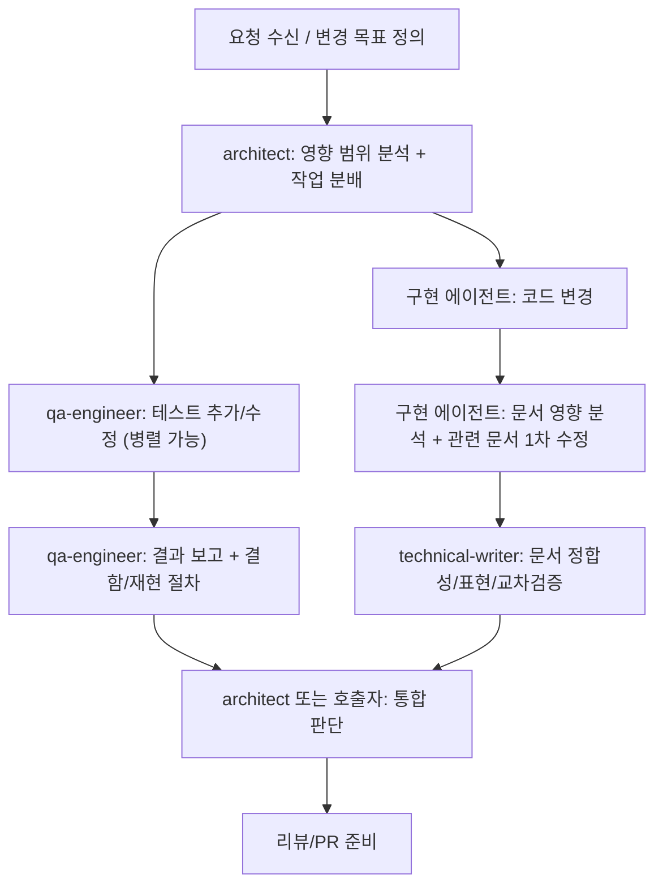

# 서브에이전트 작업 흐름 (Agent Workflow)

## 목적
- 기능 변경이 들어왔을 때 어떤 에이전트를 어떤 순서로 호출해야 하는지 정의한다.
- 설계 승인, 구현, 테스트, 문서 반영, 리뷰 준비의 공통 흐름을 고정한다.

## 적용 범위
- `dbgate` 저장소의 설계/구현/테스트/문서 작업 전반

## 전체 흐름 (표준)

## 단계별 상세

### 1. 설계/조율 (`architect`)
- 입력:
  - 변경 목표
  - 영향 파일/모듈 후보
  - 기존 인터페이스/스펙
  - Linear 이슈 본문 최소 필드 (변경 유형별):

| 변경 유형 | 최소 필드 |
|---|---|
| `behavior` | Goal, In Scope, Acceptance Criteria, Affected Modules |
| `interface` | Goal, In Scope, Acceptance Criteria, Affected Modules, Risks |
| `ops` | Goal, In Scope, Acceptance Criteria, Affected Modules, Risks |
| `perf` | Goal, In Scope, Acceptance Criteria, Affected Modules, 측정 기준 |
| `docs-only` | Goal, Scope, Done 기준 |
| `internal-refactor` | Goal, Scope, 비영향 가정 |
- 출력:
  - 작업 분배 (에이전트별)
  - 의존성/병렬화 계획
  - 인터페이스 변경 승인 여부
  - Execution Brief 코멘트 (Linear 이슈에 `📋 Execution Brief v<N>` 형식으로 남김)
    - 표준/경량은 변경 유형에 따라 결정
    - 작성 규칙: `docs/process/execution-brief-template.md` 참조

### 2. 구현 (`network-engineer` / `security-engineer` / `infra-engineer` / `go-engineer`)
- 입력:
  - Linear ID + 최신 Execution Brief 버전
  - `CLAUDE.md`, 담당 에이전트 프롬프트, 프로세스 문서
- 수행:
  - 담당 경로 내 구현
  - 테스트/재현 절차 준비
  - 문서 영향 분석
  - 관련 문서 1차 수정 (허용 범위 내)
- 주의:
  - 확정 인터페이스 임의 변경 금지
  - C++↔Go 계약 변경은 architect 승인 필요
- 완료 보고 시 `프롬프트/계획 메타데이터` 필드를 반드시 포함 (handoff-report-schema.md 참조)

### 3. 테스트/검증 (`qa-engineer`)
- 수행:
  - 단위/통합/퍼징/벤치마크(해당 시) 보강
  - 결함 재현 절차 정리
  - 테스트 결과 보고
- 출력:
  - 실패 재현 절차
  - 커버리지/엣지 케이스 보강 내역

### 4. 문서 정합성 (`technical-writer`)
- 수행:
  - 구현자가 수정한 문서 검토
  - 용어 통일 / 교차 문서 불일치 수정
  - 누락 문서 식별 및 보완
- 주의:
  - 설계 미확정 사항을 문서에서 단정하지 않음

### 5. 통합 판단 (`architect` 또는 호출자)
- 확인 항목:
  - 인터페이스 규약 준수
  - 테스트 결과
  - 문서 영향 분석/문서 수정 여부
  - 교차영향 후속 작업 존재 여부

### 6. 상태 전이 (반자동)
- `In Progress → In Review` 전이 시 체크리스트 확인 필수
- 체크리스트 항목:
  1. Execution Brief 코멘트 존재 (📋)
  2. Handoff Report 존재 (✅)
  3. 테스트/검증 결과 존재
  4. 문서 영향 분석 존재
  5. (해당 시) Architect 승인 근거 존재
- 상세: `docs/process/state-transition-checklist.md` 참조
- 전이는 사람이 수행한다.

## 승인 게이트 (중요)

### architect 승인 필수
- `.hpp` 인터페이스 의미 변경
- C++↔Go 경계 변경 (UDS 커맨드/JSON 필드/프로토콜 의미)
- 모듈 책임/경계 변경

### writer 검토 권장
- 사용자 가시 동작/명령어 변경
- 운영 절차 변경 (`deploy`, `CI`, 런북 영향)
- 보안 한계/탐지 규칙 설명 변경

## 변경 유형별 기본 흐름

### `behavior`
- 구현 에이전트 변경 -> QA 검증 -> 문서 영향 분석 -> writer 정합성 검토

### `interface`
- architect 승인 -> 구현/QA -> 인터페이스 문서 업데이트 -> writer 검토

### `ops`
- infra/go 변경 -> 재현 절차 검증 -> runbook/observability 영향 반영 -> writer 검토

### `internal-refactor`
- 동작/인터페이스/운영 영향 없으면 문서 미수정 가능
- 단, 완료 보고에 사유 명시 필수

## 실패/재작업 루프
- 인터페이스 불일치: `architect`가 재분배/승인 조정
- 테스트 실패: 구현 에이전트 또는 `qa-engineer` 재작업
- 문서 누락/불일치: 구현 에이전트 1차 보완 후 `technical-writer` 재검토

## AI용 빠른 실행 규칙 (요약)
1. 먼저 `architect` 지시 또는 기존 인터페이스를 확인한다.
2. 담당 경로 밖 수정은 하지 않는다.
3. 완료 보고에 반드시 `문서 영향 분석`을 포함한다.
4. 경계 계약 변경은 스스로 확정하지 않는다.
5. Execution Brief를 확인하고 Brief에 명시된 범위/제약을 준수한다.
6. 완료 보고에 `프롬프트/계획 메타데이터`를 포함한다.
