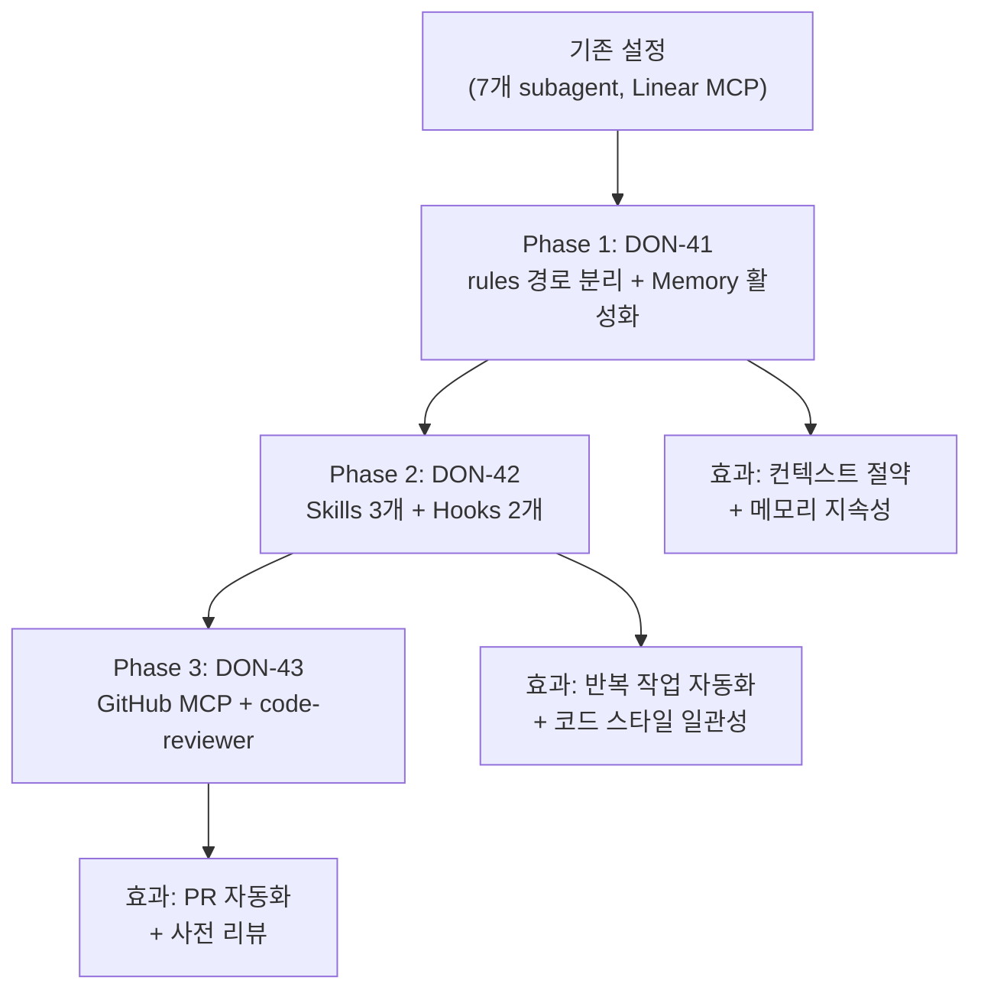

# Claude Code 워크플로우 최적화 v1

## 목적
Claude Code (개발자 에이전트 플랫폼)의 5가지 핵심 기능을 프로젝트에 도입하여 에이전트 간 협업 효율성과 문맥 관리를 개선한다.
이 문서는 Phase 1(DON-41), Phase 2(DON-42), Phase 3(DON-43)에 걸쳐 수행되는 Claude Code 기능 도입의 배경, 결정, 계획을 기록한다.

---

## 1. Claude Code 핵심 기능 개요

### 1.1 Custom Subagents (`.claude/agents/`)
- **정의**: 역할 특화, 모델/도구/메모리 설정이 가능한 전담 에이전트
- **용도**: 프로젝트 구조상 담당 경로가 명확한 역할(architect, security-engineer 등)을 자동으로 위임
- **설정 파일**: `.claude/agents/<에이전트명>.md` (YAML 프론트매터 + 프롬프트)
- **현재 상태**: 7개 에이전트 구축 완료
  - architect (설계/조율, plan mode)
  - network-engineer (프록시/프로토콜/헬스체크)
  - security-engineer (SQL 파서/정책 엔진)
  - infra-engineer (로거/통계/CI/배포)
  - go-engineer (Go 컨트롤플레인/CLI/대시보드)
  - qa-engineer (테스트/벤치마크)
  - technical-writer (문서)

### 1.2 Skills (`.claude/skills/`)
- **정의**: 슬래시 커맨드(`/명령어`)로 트리거되는 반복 작업 자동화
- **예시**:
  - `/build-test` — CMake 빌드 + 테스트 + ASan 원클릭
  - `/start-task DON-XX` — Linear 이슈에서 브랜치 생성 및 작업 환경 준비
  - `/doc-impact` — Doc Impact 규칙 자동 체크
- **현재 상태**: Phase 2에서 도입 계획

### 1.3 RAG & Context Management
#### 계층적 규칙 (`.claude/rules/`)
- **정의**: 파일 경로별 조건부 규칙 로드로 컨텍스트 윈도우 최적화
- **구조**:
  - `cpp-core.md` (paths: `src/**/*.cpp`, `src/**/*.hpp`) — C++ 코딩 규칙
  - `go-tools.md` (paths: `tools/**/*.go`) — Go 코딩 규칙
  - `testing.md` (paths: `tests/**`, `benchmarks/**`) — 테스트 규칙
  - `general.md` — 모든 파일 기본 규칙
- **효과**: 해당 경로 수정 시에만 관련 규칙 로드 → 토큰 절약
- **현재 상태**: Phase 1 신규 적용

#### Agent Memory (`.claude/agent-memory/`)
- **정의**: 에이전트별 장기 메모리 (작업 기록, 학습한 패턴 저장)
- **저장 구조**: `.claude/agent-memory/<에이전트명>/`
- **추적**: `.gitignore`에 포함 (git 추적 안 됨)
- **devcontainer 유지**: `.:/workspace:cached` 볼륨 마운트로 컨테이너 재생성 후에도 보존
- **로컬 환경**: 파일시스템 직접 접근이므로 문제 없음
- **현재 상태**: Phase 1에서 전체 7개 에이전트 활성화

#### Auto-Memory
- **정의**: Claude Code 자동 관리 메모리 (프로젝트 구조, 최근 작업 내용 자동 학습)
- **저장 위치**: `/root/.claude/projects/` (사용자 홈 `.claude/` 디렉토리)
- **devcontainer 유지**: `source=${HOME}/.claude → target=/root/.claude` 바인드 마운트로 보존
- **용도**: 에이전트가 명시적으로 메모리를 작성하지 않아도 프로젝트 맥락 자동 유지

### 1.4 MCP (Model Context Protocol)
- **정의**: 외부 도구/서비스를 Claude와 통합하는 표준 프로토콜
- **현재 활용**:
  - Linear MCP — 이슈 조회 (`get_issue`), 목록 조회 (`list_issues`), 코멘트 작성 (`create_comment`)
  - 활용 시나리오: Execution Brief 작성 및 Handoff Report 자동 코멘트
- **계획 (Phase 3)**:
  - GitHub MCP — PR 생성/변경, 워크플로우 트리거
  - Slack MCP — 알림/보고 통합

### 1.5 Hooks
- **정의**: Pre/Post 도구 실행 이벤트에 자동 트리거되는 스크립트
- **예시**:
  - PreToolUse — 위험한 Bash 명령(`rm -rf`, `git reset --hard`) 차단/확인
  - PostToolUse — C++ 파일 편집 후 `clang-format` 자동 실행
- **현재 상태**: Phase 2에서 도입 계획

---

## 2. 현재 프로젝트 적용 현황 (2026-02-25)

| 기능 | 상태 | 시작 Phase |
|------|------|-----------|
| Custom Subagents (7개) | ✅ 구축 완료 | 초기 |
| Linear MCP | ✅ 연결됨 | 초기 |
| `.claude/rules/` 경로별 분리 | ✅ Phase 1 적용 | DON-41 |
| Agent Memory 전체 활성화 | ✅ Phase 1 적용 | DON-41 |
| Skills | 계획 중 | Phase 2 (DON-42) |
| Hooks | 계획 중 | Phase 2 (DON-42) |
| GitHub MCP | 계획 중 | Phase 3 (DON-43) |

---

## 3. Phase 1: 규칙 분리 및 메모리 활성화 (DON-41)

### 3.1 결정사항: `.claude/rules/` 경로별 조건부 규칙

#### 문제 상황
- 기존: 모든 규칙을 `CLAUDE.md`에 단일 문서로 관리
- 한계: C++ 코딩 규칙을 읽을 때마다 Go, 테스트, 배포 규칙까지 모두 로드 → 토큰 낭비

#### 해결 방식
`.claude/rules/` 디렉토리에 경로 조건부 규칙 파일 생성:

```
.claude/rules/
├── cpp-core.md          # paths: src/**/*.cpp, src/**/*.hpp
├── go-tools.md          # paths: tools/**/*.go
├── testing.md           # paths: tests/**, benchmarks/**
└── general.md           # (조건 없음 — 항상 로드)
```

#### 각 규칙 파일 구성
- **cpp-core.md**
  - C++23 표준, GCC 14
  - Boost.Asio co_await 비동기 강제
  - snake_case 네이밍, shared_ptr/unique_ptr, std::expected 에러 패턴
  - spdlog 로깅, fmt::format
  - 금지사항: raw epoll, 전역 변수, `using namespace std;`

- **go-tools.md**
  - 표준 Go 컨벤션, golangci-lint 통과 필수
  - 에러 처리 필수 (언더스코어 무시 금지)

- **testing.md**
  - 모든 public 함수 단위 테스트
  - 통합 테스트, 퍼징, 벤치마크(해당 시)
  - CMake/Go 테스트 운영 기준

- **general.md** (항상 로드)
  - 프로젝트 개요, 아키텍처 규칙, Git Workflow
  - 모듈 의존 방향, fail-close 원칙
  - 서브에이전트 사용법

#### 효과
- C++ 파일 수정 시: `cpp-core.md` + `general.md`만 로드 (Go/테스트 규칙 제외)
- Go 파일 수정 시: `go-tools.md` + `general.md`만 로드 (C++ 규칙 제외)
- 컨텍스트 윈도우 약 30-40% 절약 → 더 정교한 문장 생성 가능

### 3.2 결정사항: Agent Memory 전체 활성화

#### 문제 상황
- 기존: architect, qa-engineer만 memory 활성화
- 한계: 다른 에이전트(network-engineer, security-engineer 등)가 작업 기록을 지속하지 못함 → 반복 실수, 학습 불가

#### 해결 방식
모든 7개 에이전트의 에이전트 정의 YAML에 `memory: project` 추가:

```yaml
name: network-engineer
memory: project
capabilities:
  - read-write
```

#### 메모리 저장 및 유지 메커니즘
| 항목 | 저장 위치 | Git 추적 | devcontainer 유지 | 로컬 유지 |
|------|----------|---------|------------------|----------|
| Agent Memory | `.claude/agent-memory/<agent>/.claude-memory` | ❌ (.gitignore) | ✅ (볼륨 마운트: `/workspace:cached`) | ✅ |
| Auto-Memory | `/root/.claude/projects/...` | ❌ | ✅ (바인드 마운트: `${HOME}/.claude`) | ✅ |

#### devcontainer 볼륨/마운트 설정 검증

`.devcontainer/devcontainer.json` 예시:
```json
{
  "volumes": [
    ".:/workspace:cached"
  ],
  "mounts": [
    "source=${HOME}/.claude,target=/root/.claude,type=bind,consistency=default"
  ]
}
```

- `cached` 옵션: 컨테이너 재생성 후에도 `.claude/agent-memory/`의 파일 보존
- 바인드 마운트: 사용자 홈의 `.claude/`를 컨테이너 `/root/.claude/`에 연결 → Auto-Memory 보존

#### 효과
- 각 에이전트가 작업 패턴 학습 → 반복 질문 감소
- 이슈 간 문맥 유지 (예: DON-40에서 배운 SQL 파서 구조를 DON-41에 자동 적용)
- 새로운 에이전트 투입 시에도 프로젝트 기록 공유 가능

---

## 4. Phase 2: Skills & Hooks 도입 (DON-42) — 계획

### 4.1 Skills 3개 신규 생성

#### `/build-test` — 원클릭 빌드/테스트/분석

**목적**: 구현 에이전트가 빌드 → 테스트 → ASan 메모리 체크를 일관되게 수행하도록 자동화

**작동**:
```bash
/build-test
```

**실제 수행 단계**:
1. `cmake --preset default && cmake --build build/default` (기본 빌드)
2. `cmake --build build/default --target test` (테스트 실행)
3. `cmake --preset asan && cmake --build build/asan` (ASan 빌드)
4. ASan 빌드 테스트 (메모리 버그 감지)
5. 결과 요약 및 실패 시 상세 출력

**이점**:
- 에이전트가 빌드/테스트 명령어 암기 불필요
- 일관된 빌드 설정 보장
- 메모리 버그를 자동으로 탐지

#### `/start-task DON-XX` — 작업 환경 자동 준비

**목적**: Linear 이슈 → 로컬 개발 환경 준비 자동화

**작동**:
```bash
/start-task DON-42
```

**실제 수행 단계**:
1. Linear에서 `DON-42` 이슈 조회
2. 이슈 제목으로부터 브랜치명 생성 (`feat/DON-42-<module-name>`)
3. 로컬 저장소에서 브랜치 생성 (`git checkout -b <branchname>`)
4. Linear 상태 변경: `Todo` → `In Progress`
5. Brief 코멘트 존재 여부 확인, 미존재 시 경고
6. 작업 메모리 초기화 (Agent Memory에 작업 로그 시작)

**이점**:
- 수동 브랜치 생성 불필요
- Git/Linear 상태 불일치 방지
- Brief 누락을 자동으로 감지

#### `/doc-impact` — Doc Impact 자동 분석

**목적**: 수정된 파일 목록 → 영향받는 문서 자동 추천 (`.claude/ownership-map.yaml` 기반)

**작동**:
```bash
/doc-impact
```

**실제 수행 단계**:
1. 현재 브랜치의 변경 파일 목록 조회 (`git diff --name-only main`)
2. `.claude/ownership-map.yaml`에서 경로별 문서 후보 조회
3. 영향받는 문서 목록 출력
4. 수정되지 않은 문서는 "⚠️ 미수정" 표시
5. `docs/` 수정 사항이 있으면 "✅ 수정됨" 표시

**이점**:
- CI의 `check-doc-impact.sh` 통과율 향상
- 문서 누락 사전 방지
- 사람의 판단은 유지 (자동 수정 아님)

### 4.2 Hooks 2개 설정

#### PreToolUse Hook — 위험 명령 차단

**목적**: 실수로 프로젝트를 손상시키는 명령 차단

**차단 대상**:
- `rm -rf /workspace` — 프로젝트 전체 삭제
- `git reset --hard` (확인 없음) — 커밋 이력 손상
- `git clean -f` (확인 없음) — 미추적 파일 삭제
- `rm -rf .git/` — git 저장소 손상

**작동 방식**:
1. Bash 명령 실행 직전 Hook 트리거
2. 차단 대상 명령이면 사용자 확인 요청
3. 사용자 승인 후에만 실행

**예시**:
```
⚠️ 위험한 명령을 감지했습니다: rm -rf /workspace
정말로 실행하시겠습니까? (yes/no)
```

**이점**:
- 자동 작업 중 실수 방지
- 프로젝트 백업/복구 불필요
- 에이전트 신뢰도 향상

#### PostToolUse Hook — C++ 자동 포매팅

**목적**: C++ 코드 편집 후 스타일 자동 일관성 유지

**작동 방식**:
1. 모든 C++ 파일(`.cpp`, `.hpp`) 편집 후 Hook 트리거
2. 해당 파일에 대해 `clang-format` 실행 (`.clang-format` 설정 사용)
3. 자동 정렬된 파일 자동 저장

**적용 범위**:
- `src/**/*.cpp`, `src/**/*.hpp`

**이점**:
- 수동 `clang-format` 실행 불필요
- 스타일 일관성 보장
- PR 리뷰에서 스타일 지적 감소

---

## 5. Phase 3: GitHub MCP 연결 및 code-reviewer 에이전트 (DON-43) — 계획

### 5.1 GitHub MCP 연결

**설정**:
```bash
claude mcp add --transport http --scope project github
```

**연결 가능 기능**:
- PR 생성 (로컬 커밋 기반)
- PR 설명 자동 작성 (Brief 기반)
- 워크플로우 트리거 (CI 자동 실행)
- 코드 리뷰 요청 자동화

**운영**:
- `.mcp.json`에서 팀 공유 설정 관리
- 각 에이전트가 GitHub 접근 시 권한 분리

### 5.2 code-reviewer 에이전트 추가 (Read-only + Plan Mode)

**정의**:
- PR 변경 사항 리뷰 (코드/테스트/문서)
- 실제 수정 권한 없음 (plan mode)
- 개선 제안만 코멘트로 남김

**역할**:
- 인터페이스 계약 검증
- 테스트 커버리지 확인
- 문서/코드 일관성 검증
- 성능 영향 분석

**이점**:
- 사람 리뷰 전에 AI 사전 검토
- 자동 리뷰로 PR 리뷰 시간 단축
- 반복되는 지적(네이밍, 주석) 자동화

---

## 6. devcontainer 환경 검증

### 6.1 마운트 구성 확인

프로젝트 `.devcontainer/devcontainer.json`:
```json
{
  "image": "ghcr.io/dbgate/dev:latest",
  "volumes": [
    ".:/workspace:cached"
  ],
  "mounts": [
    "source=${HOME}/.claude,target=/root/.claude,type=bind,consistency=default"
  ],
  "workspaceFolder": "/workspace"
}
```

### 6.2 메모리 유지 확인 결과

| 메모리 종류 | 저장 위치 | 마운트 설정 | 컨테이너 재생성 시 | 로컬 환경 |
|-----------|---------|-----------|------------------|----------|
| Agent Memory | `/workspace/.claude/agent-memory/` | `cached` 볼륨 | ✅ 유지됨 | ✅ 유지됨 |
| Auto-Memory | `/root/.claude/projects/` | 바인드 마운트 | ✅ 유지됨 | ✅ 유지됨 |

### 6.3 실무 영향

- **devcontainer 사용자**: 컨테이너 재생성 후에도 메모리 자동 유지 (복구 불필요)
- **로컬 개발 환경 사용자**: 파일시스템 직접 접근이므로 메모리 항상 유지
- **팀 공유**: `.mcp.json` 등 설정 파일을 레포에 커밋하여 모든 팀원이 동일 환경 구성

---

## 7. 도입 순서 및 의존성



### 의존성 정리
- Phase 1은 독립적 (기존 설정과 상충 없음)
- Phase 2는 Phase 1 완료 후 진행 권장 (안정성)
- Phase 3는 Phase 2 이후 진행 (GitHub 연결 순서 고려)

---

## 8. 설정 파일 체크리스트

### 필수 파일 (이미 존재)
- `.claude/agents/*.md` — 7개 에이전트 정의
- `CLAUDE.md` — 프로젝트 지침

### Phase 1에서 신규 추가 필요
- `.claude/rules/cpp-core.md`
- `.claude/rules/go-tools.md`
- `.claude/rules/testing.md`
- `.claude/rules/general.md`
- `.gitignore` 업데이트: `.claude/agent-memory/` 추가

### Phase 2에서 신규 추가 필요
- `.claude/skills/build-test.md`
- `.claude/skills/start-task.md`
- `.claude/skills/doc-impact.md`
- `.claude/hooks/pre-tool-use.js` (또는 Python)
- `.claude/hooks/post-tool-use.js`
- `.claude/ownership-map.yaml` (문서 경로 매핑)

### Phase 3에서 신규 추가 필요
- `.mcp.json` (GitHub MCP 설정)
- `.claude/agents/code-reviewer.md` (새 에이전트)

---

## 9. 관련 문서 및 참조

| 문서 | 용도 |
|------|------|
| `CLAUDE.md` | 프로젝트 기본 규칙 및 서브에이전트 정의 |
| `docs/process/agent-workflow.md` | 에이전트 작업 흐름 |
| `docs/process/execution-brief-template.md` | Brief 작성 규칙 |
| `docs/process/handoff-report-schema.md` | 완료 보고 형식 |
| `.devcontainer/devcontainer.json` | devcontainer 환경 설정 |

---

## 10. FAQ

### Q1. Agent Memory는 실제로 저장되는가?
**A.** 네. `.claude/agent-memory/<agent>/.claude-memory` 파일(JSON)로 저장되며, git에 추적되지 않습니다. devcontainer에서는 `cached` 볼륨 덕분에 컨테이너 재생성 후에도 보존됩니다.

### Q2. Phase 1만 먼저 적용할 수 있는가?
**A.** 네. Phase 1은 독립적이며, 기존 설정과 충돌하지 않습니다. Phase 2/3는 필요에 따라 순차 적용 가능합니다.

### Q3. Skills가 실패하면?
**A.** Skills는 내부적으로 Bash/Python을 호출하므로, 빌드 실패 등 정상적인 프로세스 예외는 명확한 에러 메시지와 함께 사용자에게 반환됩니다. 롤백은 불필요합니다.

### Q4. Hooks가 명령을 차단하면 복구 가능한가?
**A.** 위험 명령 차단 Hook(PreToolUse)은 실행 전 확인만 요청하므로, "아니오"를 선택하면 명령이 실행되지 않습니다. 이미 실행된 명령은 Hook이 관여할 수 없습니다.

### Q5. `.mcp.json`은 공개해도 안전한가?
**A.** `.mcp.json`에는 API 키가 아닌 연결 설정만 포함되므로 공개 가능합니다. 실제 인증은 Claude Code 플랫폼 내 별도 자격증명 관리입니다.

---

## 문서 이력

| 버전 | 날짜 | 변경사항 |
|------|------|---------|
| v1 | 2026-02-25 | 초판 작성 (Phase 1~3 계획, devcontainer 검증) |
