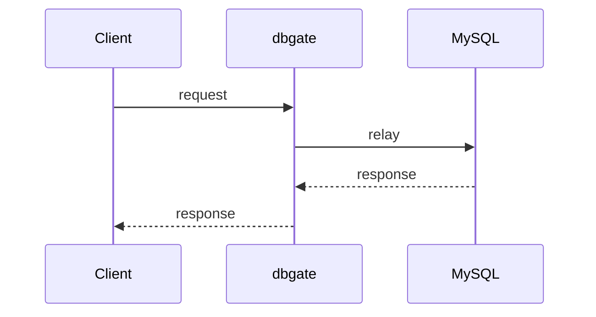

# dbgate 시퀀스 문서

## 목적
- 핵심 시나리오의 컴포넌트 간 호출 순서를 시퀀스 관점에서 정리한다.
- 아키텍처 개요(`docs/architecture.md`)보다 더 구체적인 상호작용 순서를 제공한다.

## 적용 범위
- 런타임 핵심 시나리오(핸드셰이크, 쿼리 처리, 정책 리로드, 통계 조회 등)

## 관련 문서
- `docs/architecture.md`
- `docs/data-flow.md`
- `docs/uds-protocol.md`
- `docs/interface-reference.md`

## 작성 규칙
1. 컴포넌트 이름은 실제 모듈/타입/프로세스 명칭과 맞춘다.
2. 분기 조건(`ALLOW/BLOCK`, 오류 경로)을 생략하지 않는다.
3. 타임아웃/에러/재시도 같은 운영상 중요한 경로를 별도 시퀀스로 분리한다.

## 표준 템플릿

### 시나리오 이름
- 목적:
- 트리거:
- 관련 컴포넌트:
- 결과:



### 구현/운영 주의점
- 

## 시나리오 목록 (초기)
1. MySQL 핸드셰이크 패스스루
2. `COM_QUERY` 정상 통과
3. `COM_QUERY` 정책 차단
4. 파싱 실패/정책 오류 (`fail-close`)
5. UDS stats 조회 (`tools` -> `src/stats`)
6. 정책 리로드 (CLI/신호 기반)

## 시나리오 1: MySQL 핸드셰이크 패스스루
- 목적: 클라이언트 인증 플러그인 호환성을 유지하면서 핸드셰이크를 투명 릴레이한다.
- 트리거: 새 TCP 세션 수립 (Session.run() 코루틴 시작)
- 관련 컴포넌트: `proxy/session`, `protocol/handshake` (HandshakeRelay), `protocol/mysql_packet`, MySQL 서버
- 결과: 핸드셰이크 완료 후 SessionContext에 db_user, db_name, handshake_done 기록, COM_QUERY 루프 진입

### 상태 머신 (8-state)

```mermaid
sequenceDiagram
    participant Client
    participant Proxy as dbgate<br/>(HandshakeRelay)
    participant MySQL as MySQL Server

    Proxy->>MySQL: read_packet() — 서버 Initial Handshake
    MySQL-->>Proxy: payload (type=0x0A, seq=0)
    Note over Proxy: State: kWaitServerGreeting<br/>→ kWaitClientResponse<br/>Action: kRelayToClient

    Proxy->>Client: write_packet() — 그대로 전달
    Client-->>Proxy: HandshakeResponse (seq=1)
    Note over Proxy: State: kWaitClientResponse<br/>→ kWaitServerAuth<br/>Action: kRelayToServer<br/>extract: username, db_name

    Proxy->>MySQL: write_packet() — 그대로 전달
    MySQL-->>Proxy: payload (seq=2)
    Note over Proxy: State: kWaitServerAuth<br/>classify_auth_response: 타입 판단

    alt OK (0x00)
        Proxy->>Client: write_packet() — OK 패킷
        Note over Proxy: State: kWaitServerAuth → kDone<br/>Action: kComplete<br/>ctx 업데이트
    else AuthSwitch (0xFE, payload>=9)
        Proxy->>Client: write_packet() — AuthSwitchRequest
        Note over Proxy: State: kWaitServerAuth → kWaitClientAuthSwitch<br/>Action: kRelayToClient

        Client-->>Proxy: auth_switch_reply
        Proxy->>MySQL: write_packet()
        Note over Proxy: State: kWaitClientAuthSwitch → kWaitServerAuthSwitch<br/>Action: kRelayToServer

        MySQL-->>Proxy: auth_result
        Note over Proxy: State: kWaitServerAuthSwitch<br/>classify_auth_response

        alt OK (0x00)
            Proxy->>Client: write_packet() — OK
            Note over Proxy: State: → kDone<br/>Action: kComplete
        else AuthMoreData (0x01) — 라운드트립 체인
            Proxy->>Client: write_packet() — AuthMoreData
            Note over Proxy: State: → kWaitClientMoreData<br/>Action: kRelayToClient<br/>round_trips++

            Client-->>Proxy: more_data_reply
            Proxy->>MySQL: write_packet()
            Note over Proxy: State: kWaitClientMoreData → kWaitServerMoreData<br/>Action: kRelayToServer

            MySQL-->>Proxy: result (반복 가능)
            Note over Proxy: State: kWaitServerMoreData<br/>round_trips 체크

            alt OK or Final (0x00)
                Proxy->>Client: write_packet() — OK
                Note over Proxy: State: → kDone<br/>Action: kComplete
            else AuthMoreData (0x01)
                Note over Proxy: round_trips < kMaxRoundTrips?<br/>Yes: → kWaitClientMoreData (계속)<br/>No: ParseError (fail-close)
            end
        else AuthSwitch (0xFE) — 중첩 금지
            Note over Proxy: ParseError: unexpected AuthSwitch<br/>State: → kFailed<br/>(fail-close)
        else Unknown packet
            Note over Proxy: State: → kFailed<br/>Action: kTerminateNoRelay<br/>ERR 전달 없이 종료
        end
    else AuthMoreData (0x01) — 초기 AuthMoreData
        Proxy->>Client: write_packet() — AuthMoreData
        Note over Proxy: State: kWaitServerAuth → kWaitClientMoreData<br/>Action: kRelayToClient<br/>round_trips++

        Client-->>Proxy: more_data_reply
        Proxy->>MySQL: write_packet()
        Note over Proxy: State: kWaitClientMoreData → kWaitServerMoreData<br/>Action: kRelayToServer

        MySQL-->>Proxy: result (반복 가능)
        Note over Proxy: [AuthMoreData 라운드트립 체인 반복]

    else Error (0xFF) or EOF (0xFE, payload<9)
        Proxy->>Client: write_packet() — ERR/EOF
        Note over Proxy: State: kWaitServerAuth → kFailed<br/>Action: kTerminate<br/>세션 종료
    else Unknown packet (not 0x00/0xFF/0xFE/0x01)
        Note over Proxy: State: kWaitServerAuth → kFailed<br/>Action: kTerminateNoRelay<br/>ERR 전달 없이 즉시 종료
    end
```



### 상태 머신 상세 설명

#### HandshakeState 정의 (src/protocol/handshake_detail.hpp)

```cpp
enum class HandshakeState : std::uint8_t {
    kWaitServerGreeting,    // 초기: 서버 Initial Handshake 대기
    kWaitClientResponse,    // 클라이언트 HandshakeResponse 대기
    kWaitServerAuth,        // 서버 첫 번째 auth 응답 대기
    kWaitClientAuthSwitch,  // AuthSwitch 후 클라이언트 응답 대기
    kWaitServerAuthSwitch,  // AuthSwitch 후 서버 응답 대기
    kWaitClientMoreData,    // AuthMoreData 후 클라이언트 응답 대기
    kWaitServerMoreData,    // AuthMoreData 후 서버 응답 대기
    kDone,                  // 핸드셰이크 완료
    kFailed,                // 핸드셰이크 실패
};
```

#### HandshakeAction 정의

```cpp
enum class HandshakeAction : std::uint8_t {
    kRelayToClient,    // 현재 패킷을 클라이언트에 전달
    kRelayToServer,    // 현재 패킷을 서버에 전달
    kComplete,         // 핸드셰이크 완료 — ctx 업데이트 후 종료
    kTerminate,        // 에러 — 클라이언트에 ERR 패킷 전달 후 세션 종료
    kTerminateNoRelay, // 에러 — ERR 전달 없이 즉시 세션 종료 (fail-close)
};
```

#### AuthResponseType 분류

```cpp
enum class AuthResponseType : std::uint8_t {
    kOk,           // 0x00 — 핸드셰이크 완료
    kError,        // 0xFF — 인증 실패
    kEof,          // 0xFE + payload < 9 — 핸드셰이크 실패 (EOF)
    kAuthSwitch,   // 0xFE + payload >= 9 — AuthSwitchRequest
    kAuthMoreData, // 0x01 — caching_sha2_password 등 추가 라운드트립
    kUnknown,      // 그 외 — fail-close 처리
};
```

### 구현 상세 (HandshakeRelay::relay_handshake)

#### 상태 전이 로직 (순수 함수)

```cpp
// src/protocol/handshake.cpp의 detail::process_handshake_packet()

auto process_handshake_packet(
    HandshakeState                current_state,
    std::span<const std::uint8_t> payload,
    int                           round_trips) noexcept
    -> std::expected<HandshakeTransition, ParseError>
{
    // 현재 상태에 따라 액션과 다음 상태 결정
    // 모든 로직은 소켓과 무관한 순수 함수
}
```

#### Handshake Response 필드 추출 (강화 버전)

```cpp
auto extract_handshake_response_fields(
    std::span<const std::uint8_t> payload,
    std::string&                  out_user,
    std::string&                  out_db) noexcept
    -> std::expected<void, ParseError>
{
    // 최소 길이 검증: payload.size() < 33 → ParseError

    // Capability flags 읽기 (offset 0-3, 4byte LE)
    // CLIENT_CONNECT_WITH_DB (0x00000008)
    // CLIENT_SECURE_CONNECTION (0x00008000)
    // CLIENT_PLUGIN_AUTH_LENENC (0x00200000)

    // Username: offset 32 이후의 null-terminated string

    // Auth Response 길이 계산:
    //   CLIENT_PLUGIN_AUTH_LENENC: length-encoded (1/2/3바이트)
    //     - 0xFE/0xFF는 비정상 → ParseError
    //   CLIENT_SECURE_CONNECTION: 1바이트 length + 데이터
    //   없음: null-terminated
    //   - 모든 경우 남은 payload 범위 검증

    // Database: CLIENT_CONNECT_WITH_DB 플래그 확인 후
    //   null-terminated string (필수 존재, 없으면 ParseError)
}
```

#### 라운드트립 제한 및 무한 루프 방지

```cpp
// 상수: kMaxRoundTrips = 10 (hardcoded)

// 다음 상태가 kWaitClientMoreData 또는 kWaitClientAuthSwitch일 때 증가
if (transition.next_state == HandshakeState::kWaitClientMoreData ||
    transition.next_state == HandshakeState::kWaitClientAuthSwitch)
{
    ++round_trips;
}

// kWaitServerAuthSwitch 또는 kWaitServerMoreData에서 AuthMoreData 수신 시
if (round_trips >= kMaxRoundTrips) {
    return std::unexpected(ParseError{
        kMalformedPacket,
        "handshake auth loop exceeded max round trips"
    });
}
```

#### I/O 루프 (relay_handshake 메인 로직)

```cpp
// src/protocol/handshake.cpp의 HandshakeRelay::relay_handshake()

while (state != HandshakeState::kDone &&
       state != HandshakeState::kFailed)
{
    // 1. 상태에 따라 소켓 선택
    const bool read_from_server =
        (state == kWaitServerGreeting ||
         state == kWaitServerAuth ||
         state == kWaitServerAuthSwitch ||
         state == kWaitServerMoreData);

    // 2. 패킷 읽기
    auto pkt_result = co_await read_packet(src_sock);

    // 3. Handshake Response에서 username/db_name 추출 (1회만)
    if (state == kWaitClientResponse && !fields_extracted) {
        auto extract_result = detail::extract_handshake_response_fields(
            payload, extracted_user, extracted_db);
    }

    // 4. 순수 함수로 상태 전이 판단
    auto transition_result = detail::process_handshake_packet(
        state, payload, round_trips);

    // 5. 액션 수행
    switch (transition.action) {
        case kRelayToClient:
            co_await write_packet(client_sock, pkt);
            break;
        case kRelayToServer:
            co_await write_packet(server_sock, pkt);
            break;
        case kComplete:
            co_await write_packet(client_sock, pkt);  // OK 패킷
            ctx.db_user = extracted_user;
            ctx.db_name = extracted_db;
            ctx.handshake_done = true;
            return std::expected<void, ParseError>{};
        case kTerminate:
            co_await write_packet(client_sock, pkt);  // ERR 패킷
            return std::unexpected(ParseError{...});
        case kTerminateNoRelay:
            // ERR 전달 없이 즉시 종료
            return std::unexpected(ParseError{...});
    }

    // 6. 라운드트립 카운터 증가 (필요 시)
    if (transition.next_state == kWaitClientMoreData ||
        transition.next_state == kWaitClientAuthSwitch)
    {
        ++round_trips;
    }

    // 7. 상태 전이
    state = transition.next_state;
}
```

### 구현/운영 주의점

#### 패킷 포맷 (MySQL Wire Protocol)
- 헤더: `[3byte payload_len LE][1byte sequence_id]`
- Payload: 페이로드 데이터
- read_packet()은 헤더 파싱 → payload 길이 결정 → 전체 패킷 수신
- write_packet()은 serialize() 호출 → [헤더+페이로드] 전송

#### Handshake Response 필드 추출 (extract_handshake_response_fields)
- Capability flags 읽기: offset 0-3 (4byte LE)
- Username: offset 32 이후의 null-terminated string
- Auth Response: capability flags에 따라 길이 결정
  - CLIENT_PLUGIN_AUTH_LENENC (0x00200000): length-encoded (1/2/3바이트)
    - 0xFE/0xFF 사용 시 비정상 → ParseError
  - CLIENT_SECURE_CONNECTION (0x00008000): 1byte length + 데이터
  - 없음: null-terminated
  - **모든 경우 남은 payload 검증**: auth_len > remaining → ParseError
- Database: CLIENT_CONNECT_WITH_DB (0x00000008) 플래그 설정 시에만 존재 (null-terminated)
  - 존재하면 반드시 null terminator 필요 → 없으면 ParseError

#### 라운드트립 제한
- **최대 10회** (kMaxRoundTrips=10)
- AuthMoreData 또는 AuthSwitch → AuthMoreData 라운드트립 체인이 10회 초과 시 fail-close
- 카운터는 `kWaitClientMoreData` 또는 `kWaitClientAuthSwitch` 상태 진입 시 증가

#### Unknown 패킷 처리 (fail-close)
- `kTerminateNoRelay` 액션: ERR 패킷을 클라이언트에 전달하지 않고 즉시 세션 종료
- 이유: 알 수 없는 프로토콜 상태 감지 시 정상 통신 불가능으로 판단
- 적용 상황:
  - `classify_auth_response`가 `kUnknown` 반환 (0x00/0xFF/0xFE/0x01 이외)
  - AuthSwitch 중 AuthSwitch 수신 (중첩 금지)
  - AuthMoreData 중 AuthSwitch 수신 (순서 위반)

#### 에러 처리 (fail-close 원칙)
- 패킷 읽기/쓰기 실패 → ParseError 반환 (세션 종료)
- 서버 ERR (0xFF) 또는 EOF (0xFE, payload<9) → 클라이언트로 전달 후 실패 반환
- Unknown 패킷 → kTerminateNoRelay (ERR 전달 없음)
- 라운드트립 제한 초과 → ParseError 반환 (kTerminateNoRelay 아님)

#### 멀티스레드 안전성
- Boost.Asio strand 내에서 모든 I/O 실행 (상호배제 내장)
- raw socket 접근 없음 — async_read/async_write로 안전성 보장
- detail::process_handshake_packet은 순수 함수 (상태 머신 로직)

## 시나리오 2+: TODO
- `COM_QUERY` 정상/차단
- `fail-close` 경로
- UDS stats 조회
- 정책 리로드

## 변경 체크리스트 (문서 유지보수용)
- 시퀀스의 참여자 이름이 실제 구현/문서와 일치하는가?
- 분기/오류 경로가 실제 코드와 동일한가?
- `docs/data-flow.md`와 충돌하는 설명이 없는가?
