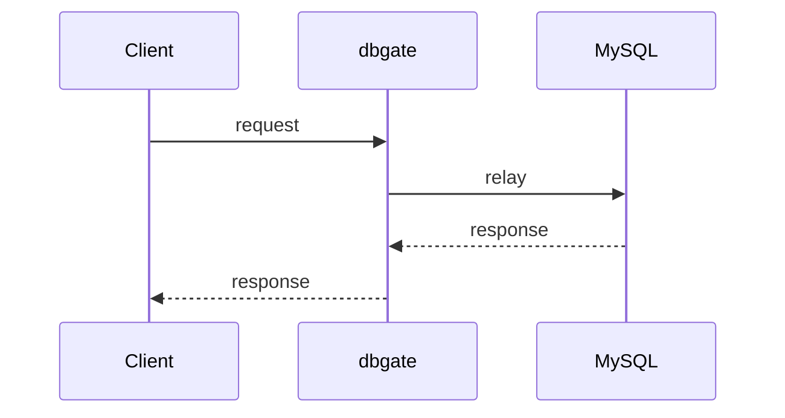
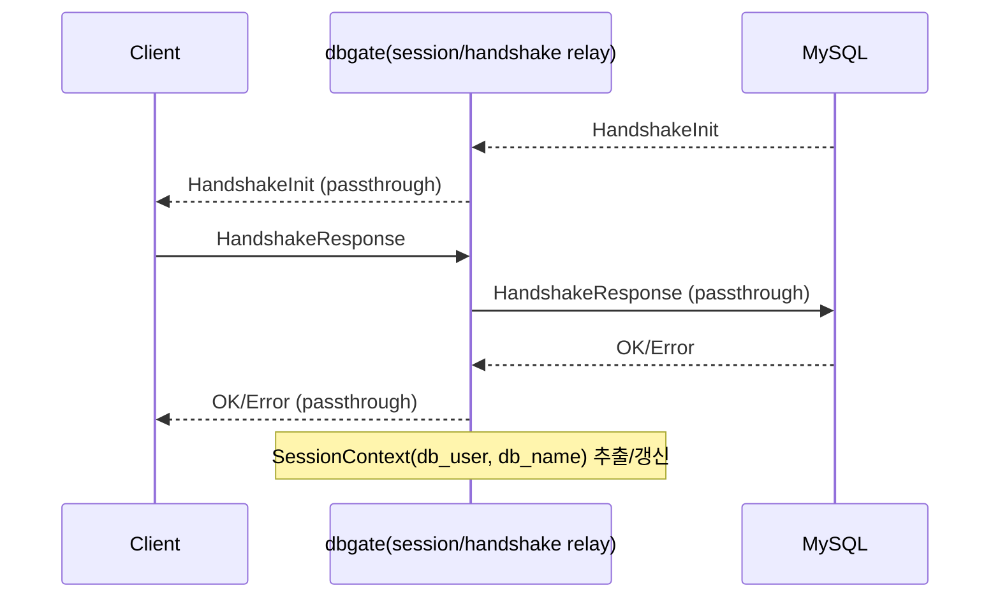

# dbgate 시퀀스 문서

## 목적
- 핵심 시나리오의 컴포넌트 간 호출 순서를 시퀀스 관점에서 정리한다.
- 아키텍처 개요(`docs/architecture.md`)보다 더 구체적인 상호작용 순서를 제공한다.

## 적용 범위
- 런타임 핵심 시나리오(핸드셰이크, 쿼리 처리, 정책 리로드, 통계 조회 등)

## 관련 문서
- `docs/architecture.md`
- `docs/data-flow.md`
- `docs/uds-protocol.md`
- `docs/interface-reference.md`

## 작성 규칙
1. 컴포넌트 이름은 실제 모듈/타입/프로세스 명칭과 맞춘다.
2. 분기 조건(`ALLOW/BLOCK`, 오류 경로)을 생략하지 않는다.
3. 타임아웃/에러/재시도 같은 운영상 중요한 경로를 별도 시퀀스로 분리한다.

## 표준 템플릿

### 시나리오 이름
- 목적:
- 트리거:
- 관련 컴포넌트:
- 결과:

### 구현/운영 주의점
- 

## 시나리오 목록 (초기)
1. MySQL 핸드셰이크 패스스루
2. `COM_QUERY` 정상 통과
3. `COM_QUERY` 정책 차단
4. 파싱 실패/정책 오류 (`fail-close`)
5. UDS stats 조회 (`tools` -> `src/stats`)
6. 정책 리로드 (CLI/신호 기반)

## 시나리오 1: MySQL 핸드셰이크 패스스루 (초안)
- 목적: 클라이언트 인증 플러그인 호환성을 유지하면서 핸드셰이크를 투명 릴레이한다.
- 트리거: 새 TCP 세션 수립
- 관련 컴포넌트: `proxy/session`, `protocol/handshake`, MySQL 서버
- 결과: 핸드셰이크 완료 후 세션 컨텍스트 초기화

### 구현/운영 주의점
- auth plugin 메커니즘에 개입하지 않음
- 핸드셰이크 실패 시 세션 종료/로그 처리 규칙 확인 필요

## 시나리오 2+: TODO
- `COM_QUERY` 정상/차단
- `fail-close` 경로
- UDS stats 조회
- 정책 리로드

## 변경 체크리스트 (문서 유지보수용)
- 시퀀스의 참여자 이름이 실제 구현/문서와 일치하는가?
- 분기/오류 경로가 실제 코드와 동일한가?
- `docs/data-flow.md`와 충돌하는 설명이 없는가?
